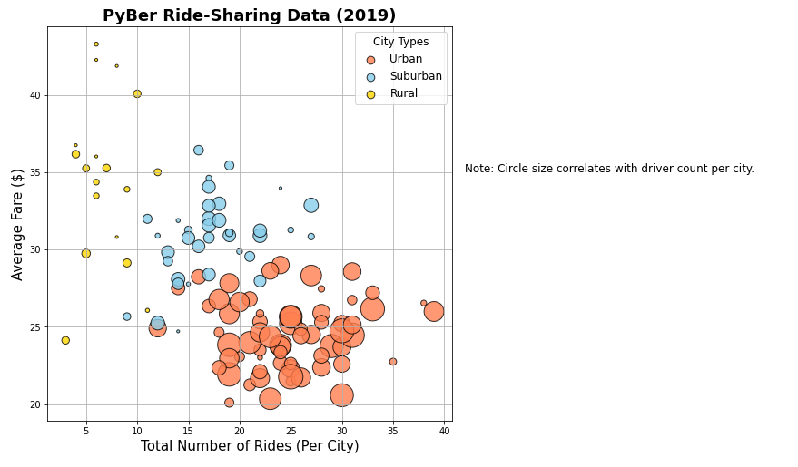
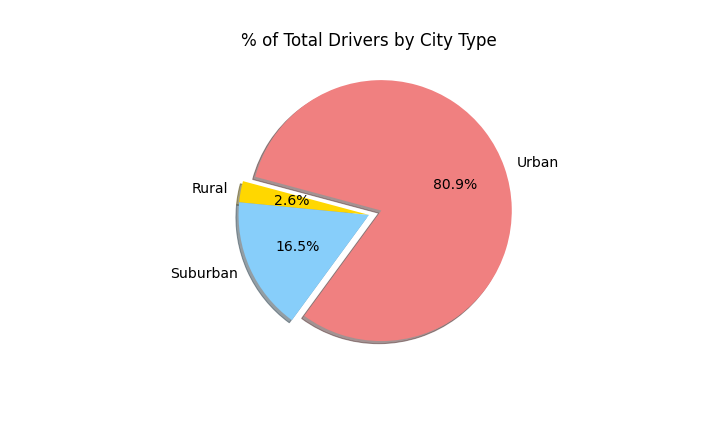
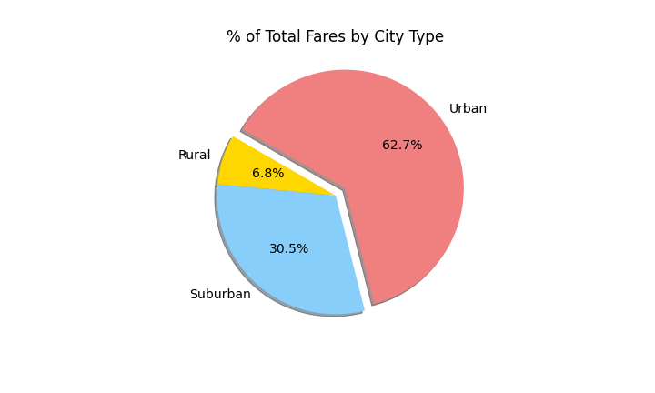
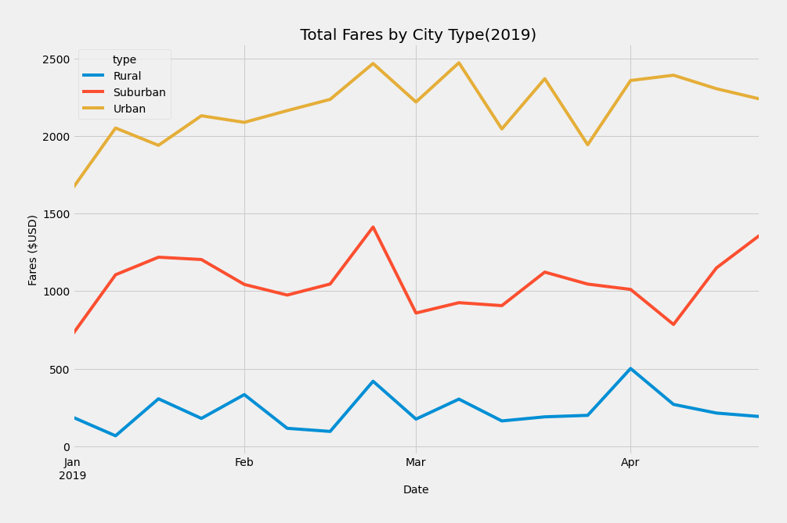

# PyBer_Analysis

### Overview: 
   &nbsp;&nbsp;&nbsp;&nbsp; In this module, we’ve been creating visualizations on ride-sharing data for a company called “Pyber” after inspecting, cleaning, ,merging, and formatting the data provided. We’re to create easy and digestible Data-Frames and charts to show the correlation between city type, total  number of drivers & riders, and total fares. In doing so the company aims to make better decisions as they move forward with their business, employees, and customers. However, we’ve been tasked to go further in-depth by creating a multiple-line graph that shows the total weekly fares for each city type(we’ll be making the data-frame alongside with it as well). From there, we’ll be able to infer noticeable trends in which the company may need to act upon.  
 
###  Results: 
 1. **Pyber Ride-Sharing Data:** Here we're given a clear depiction of Fares($) high in value for rural areas with low number of rides, we can infer that this occurs due to the low population of the city not needing the service as much in comparison to suburban and urban cities. In fact, we see suburban cities consolidate roughly around 15-20 rides per city at $30 to $35 fare ranges. Lastly, Urban cities are best for Pyber services due to high population while providing a convenient alternate means of travel throughout cities.
  
 2. **% Total Riders & Drivers by City Type:** :
    
    
   - From these pie charts we can infer that % Total Drivers is highly concentrated in Urban areas since it’s only natural to offer services in these city types, as there are high percentages of rides requested, giving drivers more incentive to operate in urban cities. However, the percentage of rides in both rural and suburban far surpass the presence of drivers in those types of cities, indicating less incentive and less presence in these city types explaining the higher fares.   
   - **% Total Fares by City Type:** 
    
   - This chart further backs the inferred claim that drivers have more incentive to operate in urban cities due to frequent high demand of services in these city types regardless of the fare prices offered being lower in comparison to rural & suburban cities.  

### Pyber-Fare-Summary:

##  Conlcusion: 
  &nbsp;&nbsp;&nbsp;&nbsp;Overall, "Pyber" is clearly thriving in Urban cities with high number of rides per city as well as, drivers per city to meet the percentage of requests despite being in excess with the respective order Driver to Rides. However, there are some disparities shown in the data beginning with rural cities regarding fares & drivers. The percentage of drivers is at 2.6% and that cannot meet the demands of 5.3% rides for rural cities, a recommendation would be to offer drivers a quarterly bonus for operating in those cities after meeting a quota of rides given. An alternative recommendation would be to offer premium ride services while creating a separate & slightly lower price for commercial riding. That way it would justify the high prices in rural areas with premium car-services while providing an alternative the option of choosing a more wallet-friendly service, this solution also works for suburban areas as we can maintain current fare prices but with premium ride services its incentive to both rider and driver. Lastly, we can incorporate a rating system to better analyze the popularity of "Pyber" as a whole, popularity by city type, infer a correlation to fares & city type, and incentivize drivers to always carry out their service in a professional manner with ratings keeping them in check.
