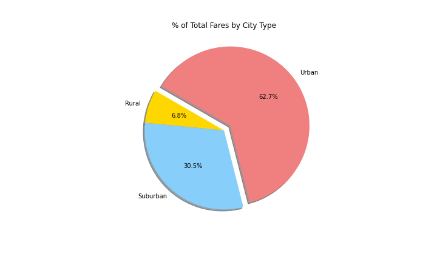

# PyBer_Analysis

### Overview: 
   &nbsp;&nbsp;&nbsp;&nbsp; In this module, we’ve been creating visualizations on ride-sharing data for a company called “Pyber” after inspecting, cleaning, ,merging, and formatting the data provided. We’re to create easy and digestible Data-Frames and charts to show the correlation between city type, total  number of drivers & riders, and total fares. In doing so the company aims to make better decisions as they move forward with their business, employees, and customers. However, we’ve been tasked to go further in-depth by creating a multiple-line graph that shows the total weekly fares for each city type(we’ll be making the data-frame alongside with it as well). From there, we’ll be able to infer noticeable trends in which the company may need to act upon.  
 
###  Results: 
 1. **Pyber Ride-Sharing Data:** Here we're given a clear depiction of Fares($) high in value for rural areas with low number of rides, we can infer that this occurs due to the low population of the city not needing the service as much in comparison to suburban and urban cities. In fact, we see suburban cities consolidate roughly around 15-20 rides per city at $30 to $35 fare ranges. Lastly, Urban cities are best for Pyber services due to high population while providing a convenient alternate means of travel throughout cities.
  
 2. **% Total Riders & Drivers by City Type:** :
    
    
   - From these pie charts we can infer that % Total Drivers is highly concentrated in Urban areas since it’s only natural to offer services in these city types, as there are high percentages of rides requested, giving drivers more incentive to operate in urban cities. However, the percentage of rides in both rural and suburban far surpass the presence of drivers in those types of cities, indicating less incentive and less presence in these city types explaining the higher fares.   
   - **% Total Fares by City Type:** 
    
   - This chart further backs the inferred claim that drivers have more incentive to operate in urban cities due to frequent high demand of services in these city types regardless of the fare prices offered being lower in comparison to rural & suburban cities.  

### Pyber-Fare-Summary:

##  Conlcusion: 
